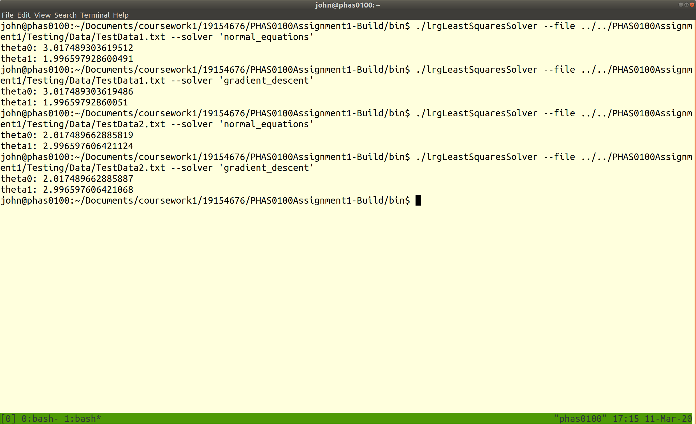
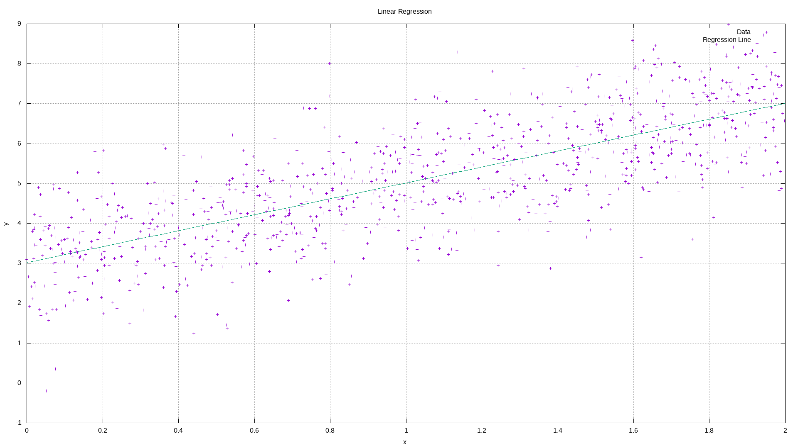
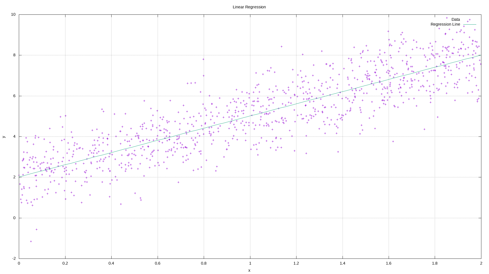
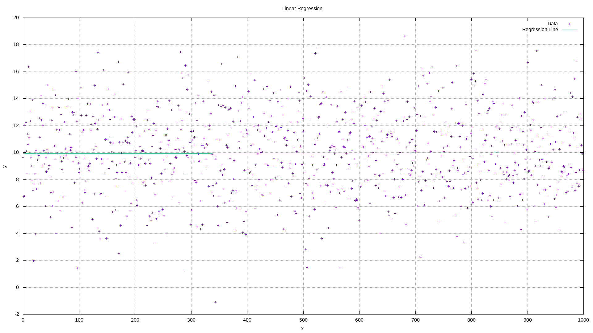

PHAS0100Assignment1
------------------

Purpose
-------
Coursework 1 by John Duffy for PHAS0100 Research Computing with C++ 2019/2020 at UCL.

A command line interface program to perform Linear Regression.

Data is supplied from a data file via the --file option, or is randomly generated via --rand option. The options --file and --rand are mutually exclusive. The data file format is space delimited 'x y' pairs, one pair on each line. The --rand option generates linear data from user specified intercept and gradient values, together with the mean and and standard deviation of random noise which is applied to the data.

The method used to solve the linear regression is one of 'normal_equations' or 'gradient_descent', which is selected via the --solver option.

The program returns the intercept and gradient (theta0 and theta1) of the linear regression.

Additionally, the program generates a Gnuplot script which can be used to generate a PNG plot of the data and resultant regression line. This can be viewed easily from the command line using the Eye of GNOME command, eog, or a similar image viewer. It is not necessary to install Gnuplot to perform the Linear Regression or produce the script, only to produce the PNG plot.


Evidence of Correct Functionality
---------------------------------




Installation and Build Instructions
-----------------------------------

This assignment has been submitted as a zip file, as required by the assignment instructions. To install from the zip file:

```
unzip 19154676.zip
cd 19154676
mkdir PHAS0100Assignment1-Build
cd PHAS0100Assignment1-Build
cmake ../PHAS0100Assignment1
make
```
To run the tests:
```
ctest
```
The executable, lrgLeastSquaresSolver, will be in the PHAS0100Assignment1-Build/bin directory.


Additionally, this assignment can be built from a private GitHub respository. The repository is private to prevent plagiarism, again, as required by the assignment instructions. To obtain the username and password for this repository please contact [John Duffy](mailto:john.duffy.19@ucl.ac.uk). To build from this repository:

```
git clone https://github.com/johnduffymsc/PHAS0100Assignment1.git
mkdir PHAS0100Assignment1-Build
cd PHAS0100Assignment1-Build
cmake ../PHAS0100Assignment1
make
```
To run the tests:
```
ctest
```
The executable, lrgLeastSquaresSolver, will be in the PHAS0100Assignment1-Build/bin directory.

To install Gnuplot (on Ubuntu 18.04):

```
sudo apt install gnuplot
```

To install Eye of GNOME (on Ubuntu 18.04):

```
sudo apt install eog
```

Useage
------

From the PHAS0100Assignment1-Build/bin directory:

```
lrgLeastSquaresSolver --file datafile --solver ['normal_equations'|'gradient_descent']
```
or
```
lrgLeastSquaresSolver --rand theta0 theta1 noise_mean noise_sigma --solver ['normal_equations'|'gradient_descent']
```

The executable will automatically produce a Gnuplot script in the current directory. To produce a PNG plot of the input data and resultant regression line from this script:

```
gnuplot lrgLeastSquaresSolver.plt
```

This will produce lrgLeastSquaresSolver.png in the current directory.

To easily view the plot from the command line using Eye of GNOME:
```
eog lrgLeastSquaresSolver.png
```

Examples
--------

From the PHAS0100Assignment1-Build/bin directory:

```
lrgLeastSquaresSolver --file ../../PHAS0100Assignment1/Testing/Data/TestData1.txt --solver 'normal_equations'
gnuplot lrgLeastSquaresSolver.plt
eog lrgLeastSquaresSolver.png
```



```
lrgLeastSquaresSolver --file ../../PHAS0100Assignment1/Testing/Data/TestData1.txt --solver 'gradient_descent'
gnuplot lrgLeastSquaresSolver.plt
eog lrgLeastSquaresSolver.png
```


```
lrgLeastSquaresSolver --file ../../PHAS0100Assignment1/Testing/Data/TestData2.txt --solver 'normal_equations'
gnuplot lrgLeastSquaresSolver.plt
eog lrgLeastSquaresSolver.png
```


```
lrgLeastSquaresSolver --file ../../PHAS0100Assignment1/Testing/Data/TestData2.txt --solver 'gradient_descent'
gnuplot lrgLeastSquaresSolver.plt
eog lrgLeastSquaresSolver.png
```



```
lrgLeastSquaresSolver --rand 10.0 0.0 0.0 3.0 --solver 'normal_equations'
gnuplot lrgLeastSquaresSolver.plt
eog lrgLeastSquaresSolver.png
```



