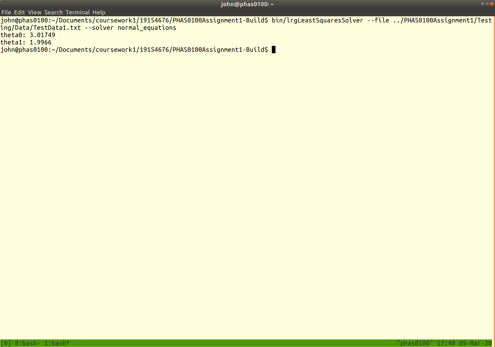
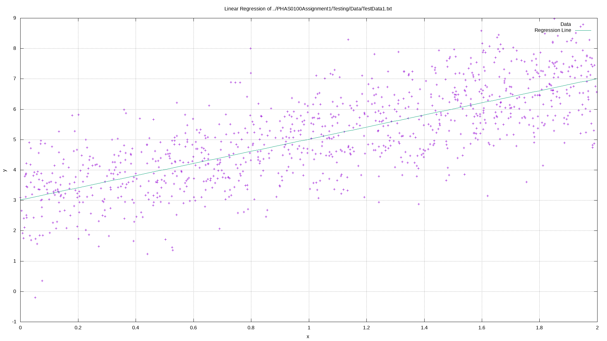
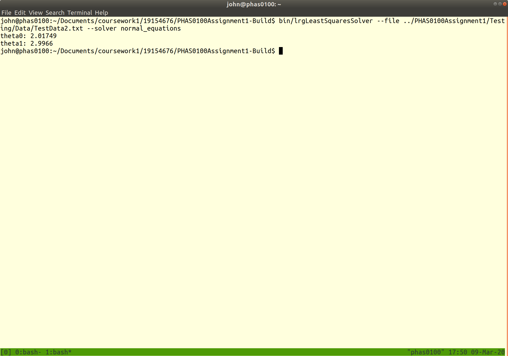
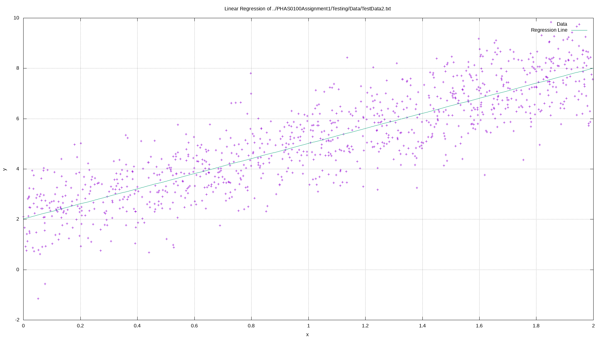

PHAS0100Assignment1
------------------

## TestData1.txt

### CLI Output



### Gnuplot Output



## TestData2.txt

### CLI Output



### Gnuplot Output




[](https://travis-ci.com/MattClarkson/PHAS0100Assignment1)
[](https://ci.appveyor.com/project/MattClarkson/cmakecatch2)


Purpose
-------

This is a demo project to demonstrate a reasonable folder structure for [CMake](https://cmake.org/) based projects,
that use [CTest](https://cmake.org/) to run unit tests via [Catch](https://github.com/catchorg/Catch2).


Credits
-------

This project was developed as a teaching aid for UCL's ["Research Computing with C++"](http://rits.github-pages.ucl.ac.uk/research-computing-with-cpp/)
course developed by [Dr. James Hetherington](http://www.ucl.ac.uk/research-it-services/people/james)
and [Dr. Matt Clarkson](https://iris.ucl.ac.uk/iris/browse/profile?upi=MJCLA42).

Installation and Build Instructions
-----------------------------------

This assignment has been submitted as a zip file, as required by the assignment instructions. To install from the zip file...

Additionally, this assignment can be built from a private GitHub respository. The repository is private to prevent plagiarism, again, as required by the assignment instructions. To obtain the username and password for this repository please contact [John Duffy](mailto:john.duffy.19@ucl.ac.uk). To build from this repository:

```
git clone https://github.com/johnduffymsc/PHAS0100Assignment1.git
mkdir PHAS0100Assignment1-Build
cd PHAS0100Assignment1-Build
cmake ../PHAS0100Assignment1
make
```

The executable, lrgLeastSquaresSolver, will be in the PHAS0100Assignment1-Build/bin directory.

In addition to displaying the values of theta0 and theta1 from the Linear Regression, the executble also produces a Gnuplot script which can be used to produce a png plot of input data and the resultant regression line. It is not necessary to install Gnuplot to produce the script, only to produce the png plot. To install Gnuplot (on Ubuntu 18.04):

```
sudo apt install gnuplot
```

Useage
------

From the PHAS0100Assignment1-Build directory:

```
bin/lrgLeastSquaresSolver --help
```
yields the following:
```
A program to perform Linear Regression.
Usage: bin/lrgLeastSquaresSolver [OPTIONS]

Options:
  -h,--help                   Print this help message and exit
  -f,--file TEXT:FILE REQUIRED
                              Data file, space separated X and y pairs, one pair per line.
  -s,--solver TEXT:{normal_equations,gradient_descent} REQUIRED
                              Solver to perform linear regression.
```


The executable will automatically produce a Gnuplot script in the directory the executable was run from. To produce a png plot of the input data and resultant regression line from this script:

```
gnuplot LeastSquaresSolver.plt
```

This will produce LeastSquaresSolver.png in the same directory.
